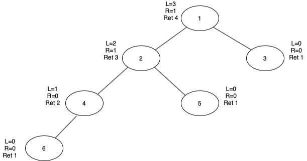

# Calculate Maximum Height of Tree

This algorithm calculates maximum height of the tree in the recursive manner based on the input tree defined in the main function of the code file. The implementation of the algorithm is in the C++ language. 

## Algorithm

1. If the tree is empty then return 0.
2. If tree has one or more nodes in it then 
    1. Get maximum height from the left subtree of current node recursively
        call maxHeight(node -> left)
    2. Get maximum height from the right subtree of current node recursively
        call maxHeight(node -> right)
    3. Calculate maximum height among left and right subtree and add + 1 to it (count the current node)
    4. Return the calculated maximum height from Step 3.

